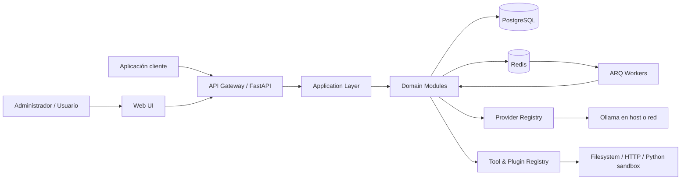

# ALSEMA AI CORE — Arquitectura del Foundation Build

## 1. Resumen

ALSEMA AI CORE se implementará inicialmente como un **monolito modular** con procesos separados para API, frontend y workers. Esta forma permite mantener límites de dominio claros sin introducir la complejidad operativa de microservicios prematuros.

La plataforma tendrá cuatro bordes principales:

1. **Web UI** para administración y uso interactivo.
2. **API pública** para clientes y SDKs.
3. **Provider adapters** para modelos de IA.
4. **Plugin/tool adapters** para capacidades externas.

## 2. Diagrama de contexto



## 3. Decisión estructural

### 3.1 Monolito modular

El backend se desplegará como una única base de código y esquema de base de datos, con módulos internos separados. Los workers importarán la misma capa de aplicación.

Ventajas para esta etapa:

- transacciones consistentes;
- menor carga operativa;
- depuración simple;
- contratos internos tipados;
- despliegue local razonable;
- posibilidad de extraer módulos más adelante si existe evidencia real.

### 3.2 Procesos

- `api`: FastAPI y endpoints WebSocket/SSE.
- `worker`: ejecución de tareas ARQ.
- `frontend`: aplicación React compilada o servida por Vite en desarrollo.
- `postgres`: persistencia principal.
- `redis`: cola, pub/sub efímero, rate limits y coordinación.
- `ollama`: externo por defecto; puede estar en el host Windows o en otra máquina.

## 4. Capas del backend

```text
backend/app/
├── api/              # HTTP, WebSocket/SSE, schemas de transporte
├── application/      # casos de uso, comandos, queries, orchestration
├── domain/           # entidades, value objects, políticas, contratos
├── infrastructure/   # SQLAlchemy, Redis, Ollama, archivos, HTTP
├── modules/          # módulos funcionales delimitados
├── core/             # configuración, seguridad, logging, errores
└── main.py
```

### 4.1 API

Responsabilidades:

- validar transporte;
- autenticar y autorizar;
- invocar casos de uso;
- transformar resultados;
- aplicar paginación, idempotencia y rate limits;
- nunca contener reglas de negocio.

### 4.2 Application

Responsabilidades:

- coordinar casos de uso;
- definir transacciones;
- invocar repositorios y gateways;
- publicar eventos internos;
- no conocer detalles de FastAPI ni SQLAlchemy.

### 4.3 Domain

Responsabilidades:

- invariantes;
- entidades y value objects;
- políticas de autorización específicas del dominio;
- interfaces requeridas por la aplicación;
- errores de dominio.

### 4.4 Infrastructure

Responsabilidades:

- implementaciones SQLAlchemy;
- adaptadores Redis/ARQ;
- proveedor Ollama;
- sandbox de archivos;
- cliente HTTP;
- observabilidad y servicios del sistema.

## 5. Módulos funcionales

### 5.1 Identity

Incluye:

- usuarios;
- autenticación;
- refresh tokens;
- roles y permisos;
- API keys y scopes;
- sesión de instalación inicial.

### 5.2 Providers

Incluye:

- registro de proveedores;
- healthchecks;
- perfiles de modelos;
- listado de modelos;
- chat/completion con streaming;
- operaciones administrativas explícitas.

Contrato conceptual mínimo:

```python
class LLMProvider(Protocol):
    async def health(self) -> ProviderHealth: ...
    async def list_models(self) -> list[ProviderModel]: ...
    async def complete(self, request: CompletionRequest) -> CompletionResult: ...
    async def stream(self, request: CompletionRequest) -> AsyncIterator[CompletionChunk]: ...
    async def cancel(self, generation_id: str) -> None: ...
```

El contrato final puede variar, pero no debe filtrar tipos específicos de Ollama al dominio.

### 5.3 Conversations

Incluye:

- conversaciones;
- ramas/versiones de mensajes;
- persistencia de mensajes;
- streaming;
- estados de generación;
- adjuntos y referencias futuras.

### 5.4 Agents

Incluye:

- definición lógica del agente;
- versiones inmutables;
- system prompt;
- perfil de modelo;
- herramientas autorizadas;
- política de memoria;
- esquema de salida;
- estado de publicación.

### 5.5 Tools and Plugins

Incluye:

- registro de plugins;
- manifests;
- registro de herramientas;
- esquemas de entrada/salida;
- permisos;
- auditoría;
- ejecución aislada.

Un plugin es un paquete de capacidades. Una herramienta es una operación invocable. No deben confundirse.

### 5.6 Tasks

Incluye:

- tarea persistente;
- ejecución ARQ;
- estados y transiciones;
- progreso;
- eventos;
- reintentos;
- cancelación cooperativa;
- resultados.

Estados mínimos:

```text
queued -> running -> succeeded
                 -> failed
                 -> cancelling -> cancelled
```

La transición debe validarse. Un worker no puede marcar como exitosa una tarea cancelada.

### 5.7 Workflows

Incluye:

- definición versionada;
- nodos y conexiones;
- validación del grafo;
- ejecución como tarea;
- estado por nodo;
- contexto de ejecución;
- salida final.

El grafo debe ser acíclico en la primera versión, salvo nodos de control explícitos incorporados en una versión futura.

### 5.8 Memory

Incluye:

- entradas de memoria;
- namespace;
- ámbito;
- propietario;
- contenido;
- metadatos;
- expiración opcional;
- búsqueda textual.

La recuperación de memoria debe respetar permisos y aislamiento entre clientes.

### 5.9 Audit and System

Incluye:

- audit events;
- configuración;
- healthchecks;
- métricas;
- logs consultables;
- información de versión.

## 6. Persistencia

PostgreSQL será la fuente de verdad para configuraciones y estados persistentes.

Redis no será fuente de verdad. Se utilizará para:

- cola ARQ;
- locks y coordinación;
- rate limiting;
- eventos efímeros de progreso;
- caché con invalidación explícita.

Los resultados importantes de tareas deben persistirse en PostgreSQL o storage, no únicamente en Redis.

## 7. Eventos internos

Se utilizarán eventos de aplicación dentro del proceso para desacoplar auditoría, métricas y notificaciones internas.

No se incorporará Kafka, RabbitMQ ni un event bus distribuido en el Foundation Build.

Eventos iniciales posibles:

- `user.created`
- `provider.health_changed`
- `agent.version_created`
- `conversation.message_created`
- `generation.started`
- `generation.completed`
- `task.progressed`
- `task.failed`
- `workflow.completed`
- `tool.invoked`

Los nombres y payloads deben quedar versionados si se exponen externamente.

## 8. Streaming

- Para chat y generación interactiva: preferir SSE si cubre el flujo unidireccional y simplifica reconexión.
- Usar WebSocket donde sea necesaria comunicación bidireccional sostenida.
- Persistir el estado de generación aparte del canal de streaming.
- Un cliente reconectado debe poder consultar el resultado final o estado actual.

## 9. Seguridad por diseño

### 9.1 Principio de mínimo privilegio

Cada usuario, API key, agente y herramienta operará con permisos explícitos.

### 9.2 Secrets

- secretos cifrados en reposo mediante una clave maestra externa;
- nunca incluidos en logs;
- nunca enviados al frontend después de guardarse;
- actualización mediante reemplazo, no lectura del valor existente.

### 9.3 Tool execution

- filesystem limitado a directorios permitidos;
- prevención de path traversal;
- HTTP con allow/deny policies y protección SSRF;
- Python ejecutado fuera del proceso API con límites de tiempo y recursos;
- sin shell arbitrario en v1.

### 9.4 Multi-client isolation

Aunque el Foundation Build pueda operar inicialmente con un único administrador, las entidades relevantes deben admitir un `namespace` o `project_id` para evitar una futura migración destructiva. Esto no implica construir tenancy empresarial completa ahora.

## 10. Frontend

```text
frontend/src/
├── app/            # routing, providers, layout
├── features/       # funcionalidades por dominio
├── components/     # componentes compartidos
├── api/            # cliente generado y adaptadores
├── stores/         # estado UI/sesión limitado
├── styles/         # tokens y base visual
└── tests/
```

La navegación principal incluirá:

- Dashboard
- Chat
- Providers & Models
- Agents
- Tools & Plugins
- Workflows
- Tasks
- Memory
- Logs & Audit
- Access
- System Settings

## 11. API pública

Base: `/api/v1`.

Categorías iniciales:

```text
/auth
/users
/roles
/api-keys
/providers
/models
/agents
/conversations
/messages
/tools
/plugins
/workflows
/tasks
/memory
/audit
/system
```

La API debe distinguir operaciones síncronas de tareas largas. Una operación larga devuelve `202 Accepted` y una referencia de tarea.

## 12. Observabilidad

Cada solicitud y tarea tendrá correlation ID.

Logs estructurados mínimos:

- timestamp UTC;
- level;
- service/process;
- request_id o task_id;
- user_id cuando corresponda;
- module;
- event;
- message;
- error type y stack en backend;
- campos sensibles redactados.

## 13. Estrategia de extensibilidad

### Proveedores futuros

Agregar un proveedor deberá requerir:

1. implementar el contrato;
2. registrar capacidades;
3. configurar credenciales/URL;
4. pasar la suite contractual de proveedores.

### Plugins futuros

Agregar un plugin deberá requerir:

1. manifest;
2. configuración validada;
3. permisos declarados;
4. herramientas o nodos registrados;
5. healthcheck;
6. pruebas.

### Clientes futuros

Un cliente empresarial deberá autenticarse por API key u OAuth futuro, usar namespaces y consumir contratos públicos. No importará código interno del Core.

## 14. Decisiones diferidas

Requieren ADR antes de implementación:

- vector database;
- almacenamiento de archivos de gran tamaño;
- GPU workers distribuidos;
- marketplace de plugins;
- multi-tenancy comercial;
- proveedores multimodales;
- webhooks públicos;
- Kubernetes;
- facturación.

## 15. Regla de extracción

Un módulo solo se convertirá en servicio independiente cuando exista evidencia de al menos una de estas necesidades:

- escalado operativo independiente;
- aislamiento de seguridad fuerte;
- ciclo de despliegue independiente;
- tecnología incompatible con el proceso principal;
- falla recurrente que compromete al resto del sistema.

Hasta entonces permanece dentro del monolito modular.
